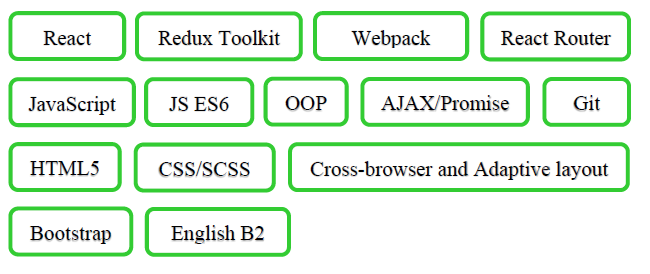

# Viachaslau Nekrysh

### Intern, Junior frontend developer

### CONTACT INFORMATION

- Minsk
- +375 (25) 615-07-86
- [vnekrish@mail.ru](mailto:vnekrish@mail.ru)
- Linkedin: [https://www.linkedin.com/in/viachaslau-nekrysh-8a0946254](https://www.linkedin.com/in/viachaslau-nekrysh-8a0946254)
- Telegram: @vjachaslau
- Skype: vjachaslau1

### BRIEF SELF-INTRODUCTION

_As a relay protection technical engineer with 14 years background, I am attentive_
_to details, interested in solving problems and good team player. I am full of energy_
_and ready to study new technologies the company works with. I am really into this_
_field, watching tech content, reading web development books._
_I believe, that my ability to learn and to gain new skills will lead me through this path of becoming a proficient Frontend Developer._

### SKILLS



### CODE

```javascript
function withRainbowFrame(colors) {
  return function (Comp) {
    return (props) => {
      const reduceCB = (acc, cur) => {
        return <div style={{ border: 'solid 5px ' + cur, padding: '5px' }}>{acc}</div>;
      };
      const rainbowFrame = colors.reduce(reduceCB, <Comp {...props} />);
      return <div style={{ width: 600, textAlign: 'center', margin: 'auto' }}>{rainbowFrame}</div>;
    };
  };
}
```

### EXPERIENCE

SPA React Ishop
Apr 2023

 During internship in IT Academy

The graduation project of the third React Single Page App “Ishop” . This project
was made using React, Redux Toolkit, React Router.

 [See the project](https://slavanekrish.github.io/react-ishop/)

Browser game with JS
Sep 2022 - Oct 2022

 During internship in IT Academy

The graduation project of the second course named Tanks 2D the browser game.
This game was made using JS ES6, SPA-app, OOP, DOM.

 [See the project](https://slavanekrish.github.io/Nekrish-FD2-119-22/!!Tanks!!/index.html)

Adaptive website with JS, flex, Bootstrap, SCSSAdaptive website with JS, flex, Bootstrap, SCSS
Jun 2022 - Jun 2022

 During internship in IT Academy

The graduation project of the first course named "The website of online store". The layout is made according to the layout provided in the Figma. Auto-completion of product cards was implemented with the help of JS. The project was made using flex, Bootstrap 5V, SCSS preprocessor. The website page is responsive. There is also a mobile version made in different style.

 [See the project](https://slavanekrish.github.io/FD1-182-22/HomeWork/Graduation%20work/index1P.html)
